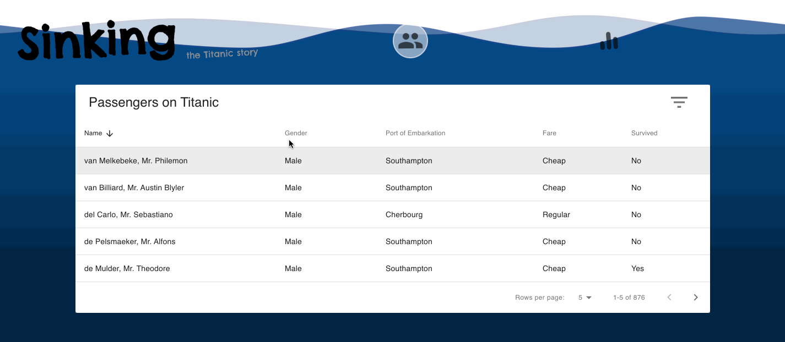
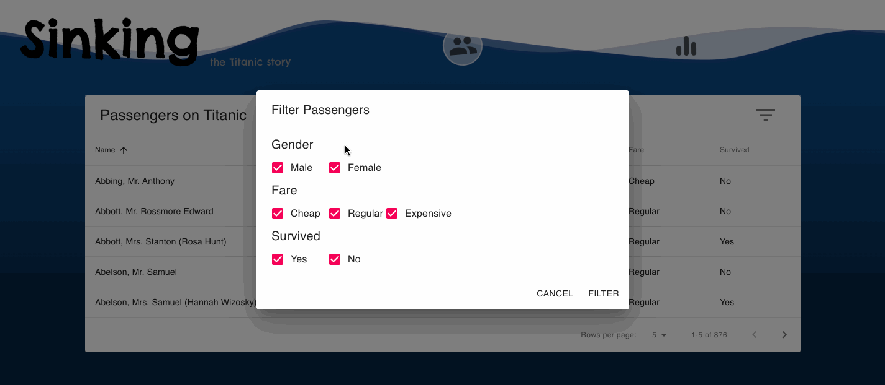
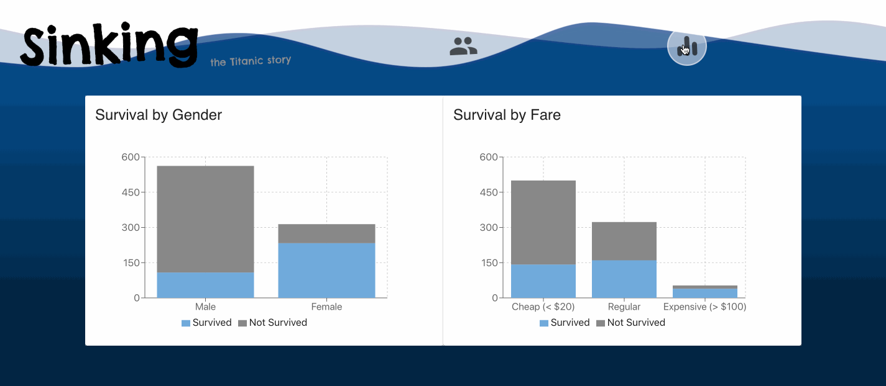

# Sinking: the Titanic Story 

[](https://dev.azure.com/sinking/Sinking/_build/latest?definitionId=1&branchName=master)

The story of Titanic, by data. https://sinking.azurewebsites.net/

Created by Anran Niu, August 2020

## Run the App Locally
```
$ git clone https://github.com/niuniuanran/Sinking.git sinking
$ cd sinking
$ npm install
$ npm start
```

## Features

### View Passengers on Titanic


* Only passengers who paid a fare is shown.

### Sort Passengers



### Filter Passengers



### Survival Statistics Visualisation



